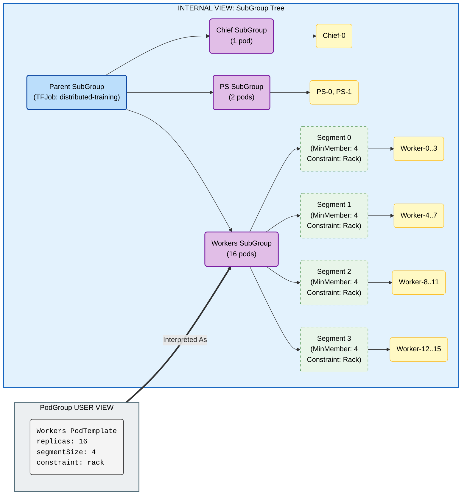

# TAS - SubGroup Segment Support

## Motivation

Distributed workloads often use hierarchical communication patterns (e.g., 16 workers in 4 tensor-parallel groups of 4). Communication within groups is frequent and requires tight locality (e.g., NVLink/NVSwitch), while inter-group communication is less frequent.

While SubGroups support hierarchical topology constraints, uniform grouping is currently not supported. We aim to support dividing a subgroup into **Segments**, where each segment has its pods co-located, without the user having to manually define $N$ identical subgroups in the spec.

## Reference Implementations

- Kueue Two-Level Topology: [PR #5449](https://github.com/kubernetes-sigs/kueue/pull/5449), [PR #5353](https://github.com/kubernetes-sigs/kueue/pull/5353), [PR #5596](https://github.com/kubernetes-sigs/kueue/pull/5596)
- SLURM topology/block plugin: [NVIDIA SLUG24 presentation](https://slurm.schedmd.com/SLUG24/NVIDIA-Craig_Tierney.pdf)

## User Stories

### Story 1: Tensor Parallelism Placement

I want my 16 pods distributed training job to be split into 4 groups of 4 pods, where each group is placed on the same rack for fast NVLink/NVSwitch communication.

### Story 2: Multi-Level Constraints

Same as story 1, but all 16 pods should be within the same zone.  

### Story 3: Simple Annotation-Based Configuration

I want to specify segment size and topology via annotations on my workload's PodTemplate without manually defining subgroups, letting the system automatically create the appropriate structure.

## Prerequisites

This design assumes the following capability exists (out of scope for this design):

- **Replica-Type SubGrouping**: Workloads are automatically sub-grouped by replica type, where each replica type (e.g., Workers, PS, Chief) has its own SubGroup. This provides the foundation for per-replica-type segmentation.

## Assumptions

- _Distributed workloads frameworks are responsible for ordering their pods_, and advertising their index as a label on the pod. Note that pod index is distinct from distributed training "rank" (see Proposal section for details).

## Proposal

- We will use the **replica index** from each pod's index label to assign pods to segments within their replica type (e.g., when segment size is 4, workers with indices 0-3 belong to segment-0, workers with indices 4-7 belong to segment-1).
  > **Note**: Pod index is used for segment assignment at scheduling time, not the distributed training "rank" which may be assigned dynamically at runtime. For frameworks where pod index maps predictably to rank, users can configure segment size accordingly, and infer their segment index from the pod index (e.g. `segment_index = replica_index / segment_size`). For frameworks with dynamic rank assignment, segment-based co-location still works, but users should be aware that rank assignment is independent of segment assignment.
- We will represent each segment as a SubGroup with its corresponding Topology Constraints, nested under the replica type's SubGroup.
- This approach builds upon the existing Hierarchical Topology Constraints mechanism and the Replica-Type SubGrouping prerequisite, providing a simplified interface that automatically translates segment specifications into the underlying SubGroup structure.

### API

- Users may define segment requirements via annotations on the **PodTemplate** of each replica type:
  - `kai.scheduler/segment-size` - Pod count for each segment
  - `kai.scheduler/segment-topology-required-placement` - Required Topology level
  - `kai.scheduler/segment-topology-preferred-placement` - Preferred Topology level
  - `kai.scheduler/pod-index-label` - (Optional) The label that denotes the pod's replica index. If not set, the PodGrouper uses the default index label for the workload type (see [Workload Index Labels](#workload-index-labels)).

> **Note**: The `kai.scheduler/topology` annotation can be set on either the PodTemplate annotations or on the workload root annotations. When defined on both, the PodTemplate annotation takes precedence as the more specific configuration. If `kai.scheduler/topology` is not provided, segment annotations are ignored.

- Example TFJob (segmentation on Workers only):
  ```yaml
  apiVersion: kubeflow.org/v1
  kind: TFJob
  metadata:
    name: distributed-training
    annotations:
      kai.scheduler/topology: "cluster-topology"
      kai.scheduler/topology-required-placement: "zone"
  spec:
    tfReplicaSpecs:
      Chief:
        replicas: 1
        template:
          spec:
            containers:
              - name: tensorflow
                image: tensorflow/tensorflow:latest
      PS:
        replicas: 2
        template:
          spec:
            containers:
              - name: tensorflow
                image: tensorflow/tensorflow:latest
      Worker:
        replicas: 16
        template:
          metadata:
            annotations:
              kai.scheduler/segment-size: "4"
              kai.scheduler/segment-topology-required-placement: "rack"
          spec:
            containers:
              - name: tensorflow
                image: tensorflow/tensorflow:latest
  ```

  This will assign the whole TFJob to the same zone, and create 4 segments within the Workers SubGroup, each with 4 pods co-located on the same rack.

### Workload Index Labels

The PodGrouper uses the following default index labels for each workload type:

| **Workload Kind**   | **Index Label** |
| ------------------- | --------------- |
| **Job (Indexed)**   | `batch.kubernetes.io/job-completion-index` |
| **PyTorchJob**      | `training.kubeflow.org/replica-index` |
| **TFJob**           | `training.kubeflow.org/replica-index` |
| **MPIJob**          | `training.kubeflow.org/replica-index` |
| **JAXJob**          | `training.kubeflow.org/replica-index` |
| **XGBoostJob**      | `training.kubeflow.org/replica-index` |
| **LeaderWorkerSet** | `leaderworkerset.sigs.k8s.io/worker-index` |

> **Note on LeaderWorkerSet**: LWS worker pods have their `worker-index` label starting from `LEADER_COUNT` instead of 0. The PodGrouper automatically subtracts the leader count to normalize the index for segment assignment (e.g., if there are 2 leaders and segment size is 4, worker with `worker-index=2` is normalized to index 0, belonging to segment-0).

> **Unsupported Workloads**: Workloads not listed in the table above (e.g., RayJobs, custom CRDs) do not have automatic index detection. For these workloads:
> - If `pod-index-label` is specified on the PodTemplate, it will be used for segmentation
> - If `pod-index-label` is not specified, segment annotations are ignored and the PodGrouper logs a warning

### PodGrouper

When the PodGrouper detects segment annotations on a PodTemplate, it performs the following:

1. **Calculate number of segments** for that replica type:
$$\text{NumSegments} = \lceil \frac{\text{ReplicaCount}}{\text{SegmentSize}} \rceil$$
2. **Create segment SubGroups**: Under the replica type's SubGroup, create `NumSegments` child SubGroups. Each SubGroup has:
   - `MinMember` = `SegmentSize` for segments covering mandatory pods (up to the replica type's MinMember)
   - `MinMember` = `0` for segments covering excess/elastic pods (beyond the replica type's MinMember)
   - The last segment may have fewer pods (smaller `MinMember`) if the count is not divisible by SegmentSize
   - Topology constraints from the segment annotations
3. **Assign pods to segment SubGroups**: When a pod is created, read its replica index and assign it to the appropriate segment:
   - Read the index from the configured or default index label
   - For LeaderWorkerSet pods, subtract the leader count to normalize the index
   - Assign to segment: 
   $$\text{SegmentID} = \lfloor \frac{\text{ReplicaIndex}}{\text{SegmentSize}} \rfloor$$

#### Elasticity Support

To support elastic workloads where the number of pods can exceed the minimum required for a successful allocation, segment SubGroups are created with appropriate `MinMember` values:

- **Mandatory segments**: Segments containing pods within the replica type's `MinMember` threshold have `MinMember` = `SegmentSize`. These pods are required for a successful allocation.
- **Elastic segments**: Segments containing pods beyond the replica type's `MinMember` threshold have `MinMember` = `0`. These pods are optional and their segment SubGroups do not block allocation if they cannot be satisfied.

**Example**: A replica type with `MinMember=12`, `ReplicaCount=20`, and `SegmentSize=4`:
- Segments 0-2 (pods 0-11): `MinMember=4` each — mandatory
- Segments 3-4 (pods 12-19): `MinMember=0` each — elastic

#### Segment requirements to SubGroup tree mapping



## Future Enhancements

- **Segment Index Injection**: KAI could inject the assigned segment index as an environment variable (e.g., `KAI_SEGMENT_INDEX`) into the pod, similar to SLURM's `SLURM_PROCID`. This would allow the workload process to determine its segment without needing to calculate it.
